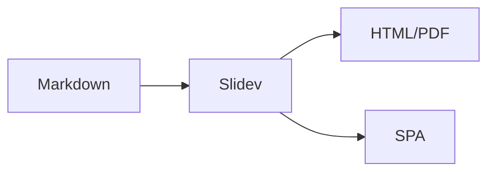

<CoverSlide 
  title="Slides Starter"
  subtitle="Create Beautiful Presentations with Markdown"
  version="1.0"
  date="2025"
  githubUrl="https://github.com/yugasun/slides-starter"
/>

---
layout: center
---

# What is Slidev?

Slidev is a slides maker and presenter designed for developers.

<v-clicks>

- 📝 **Markdown-based** - Focus on content with Markdown
- 🎨 **Themeable** - Themes can be shared and reused
- 🧑‍💻 **Developer Friendly** - Code highlighting, live coding
- 🤹 **Interactive** - Embed Vue components
- 🎥 **Recording** - Built-in recording and camera view
- 📤 **Portable** - Export to PDF, PNG, or host as SPA

</v-clicks>

---

<SectionTitle 
  number="01" 
  title="Getting Started" 
  subtitle="Quick setup guide"
  color="blue"
/>

---

# Installation

<div class="grid grid-cols-2 gap-8">

<div>

### Using Bun

```bash
bun install
bun run dev
```

</div>

<div>

### Using npm

```bash
npm install
npm run dev
```

</div>

</div>

<br>

<v-click>

### Create New Presentation

```bash
# Add new .md file in slides/
touch slides/my-presentation.md
```

</v-click>

---

<SectionTitle 
  number="02" 
  title="Components" 
  subtitle="Pre-built slide components"
  color="cyan"
/>

---

# CoverSlide Component

```markdown
<CoverSlide 
  title="Project Name"
  subtitle="A brief description"
  version="1.0"
  date="2024-01"
  githubUrl="https://github.com/user/repo"
/>
```

<div class="mt-4 p-4 bg-gray-100 rounded-lg">

**Props:** `title`, `subtitle`, `version`, `date`, `stage`, `githubUrl`, `gradientFrom`, `gradientTo`

</div>

---

# SectionTitle Component

```markdown
<SectionTitle 
  number="01" 
  title="Introduction" 
  subtitle="Getting started"
  color="blue"
/>
```

<div class="mt-4 p-4 bg-gray-100 rounded-lg">

**Props:** `number`, `title`, `subtitle`, `color`

</div>

---

# QASlide & EndSlide

<div class="grid grid-cols-2 gap-8">

<div>

### QASlide

```markdown
<QASlide 
  title="Questions?"
  subtitle="Thanks!"
  email="hi@example.com"
/>
```

</div>

<div>

### EndSlide

```markdown
<EndSlide 
  title="Thank You"
  subtitle="Let's connect"
  features="Fast · Modern"
/>
```

</div>

</div>

---

<SectionTitle 
  number="03" 
  title="Markdown Features" 
  subtitle="Power of Slidev"
  color="green"
/>

---

# Code Highlighting

```ts {all|1-2|4-6|all}
interface User {
  name: string
}

function greet(user: User) {
  console.log(`Hello, ${user.name}!`)
}
```

<arrow v-click="3" x1="350" y1="310" x2="190" y2="275" color="#564" width="2" arrowSize="1" />

<v-click at="3">

Line highlighting with click animations!

</v-click>

---

# LaTeX Support

Inline: $\sqrt{3x-1}+(1+x)^2$

Block:

$$
\begin{aligned}
\nabla \times \vec{\mathbf{B}} &= \frac{1}{c}\frac{\partial\vec{\mathbf{E}}}{\partial t} \\
\nabla \cdot \vec{\mathbf{E}} &= 4 \pi \rho
\end{aligned}
$$

---

# Diagrams with Mermaid



---

<QASlide 
  title="Questions?"
  subtitle="Thanks for watching the demo!"
  email="hello@example.com"
/>

---

<EndSlide 
  title="Slidev Starter"
  subtitle="Start creating beautiful presentations today"
  features="Markdown · Components · Themes · Export"
/>
